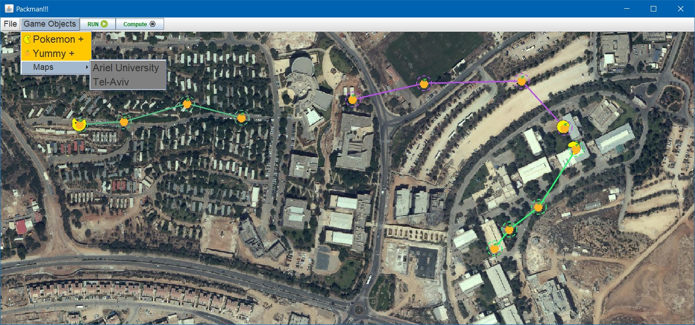
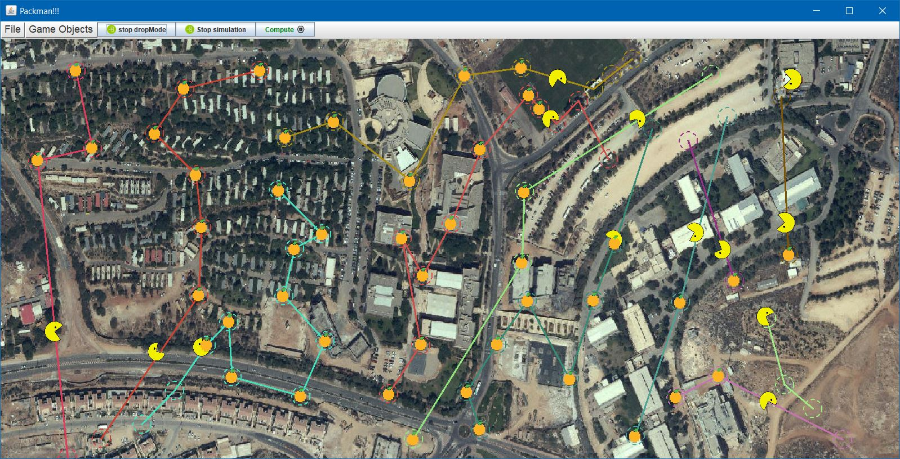
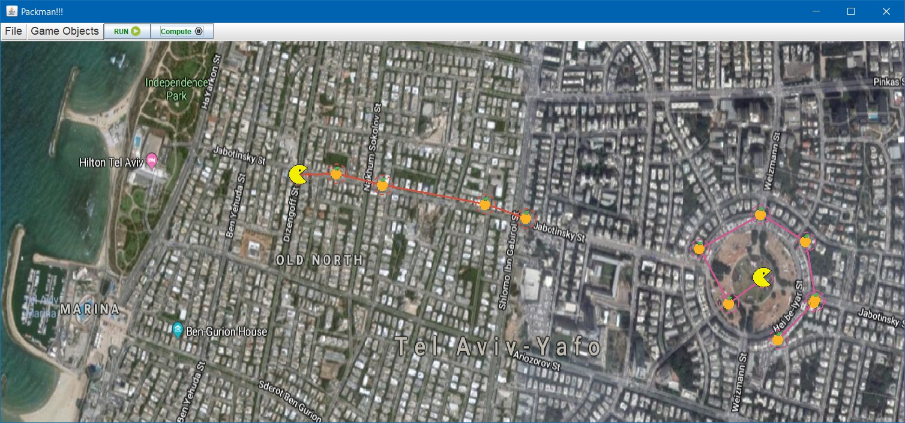
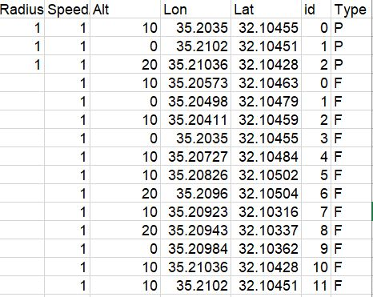
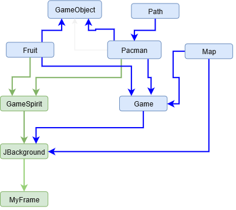

# What is it?
This is a Multi-pacman game simulation over Google Earth!  
You can fork this repisoritory and add new GameObjects by yourself!

## Demos
### Ariel University

 

 
### Tel-Aviv

 

## Contributors:
- Ofek Bader:
	-   -> https://github.com/neyney10
- Adi Lichy:
	-   -> https://github.com/Lichy24

# How to play the game?
## Game goals and notes
the goal in this game is to let the pacmans play in a group, and their group goal is to eat all fruits on game with the shortest time possible! isn't it exciting?
Of course the game is a simulation so they figure their routes by themselves but it's cool to see them chasing those little fruits!

## How to actually play?
- <u>Extra: Step 0:</u> Choose a map from the "GameObject" submenu, currently supports only "Ariel University" and "Tel-Aviv".
- <u>Step 1:</u> As was written earlier, this is a simulation game!  
you choose an object from the GameObject menu, let it be pacman or fruit, and once you click an item you'll enter to a "drop mode" which allows you to click anywhere on the map to place your chosen item!   

- <u>Step 2:</u> As your'e having fun building your own Pacman simulation, you click the "compute" button in the toolbar to let the pacmans figure out their paths!  

- <u>Step 3:</u> finally, you click the "Run" button to start the simulation and see those cute-furry-yellow-alien creatures running around!  

- <u>Step 4:</u> after you had a great time watching the pacmans playing the game of their lives, you can export your file into a KML and start watching those pacmans running over the Real world on Google Earth!
# How to save a game into a CSV file
- <u>Step 1:</u> go to the toolbar and select the "File" menu.  

- <u>Step 2:</u> select "Save game".  

- <u>Step 3:</u> set a file name with extension of ".csv" and click save. and thats it!
# How to load a saved CSV game file
- <u>Step 1:</u> go to the toolbar and select the "File" menu.  

- <u>Step 2:</u> select "Load game".  

- <u>Step 3:</u> select the game file you want to load!

Note: make sure that the CSV file (if not generated by the game) to be in this format:

# How to export the game into a KML file
Note: you must first have computed the paths of each pacman with the "Compute" button to be able to export as KML.
- <u>Step 1:</u> go to the toolbar and select the "File" menu.  

- <u>Step 2:</u> select "Export game".  

- <u>Step 3:</u> set a file name with extension of ".kml" and click save. and thats it!

# How to load a KML file into Google Earth
See: https://support.google.com/earth/answer/7365595?co=GENIE.Platform%3DDesktop&hl=en  

# Game's Shortest Path Finding Algorithm
The algorithm is a forked Dijkstra algorithm, not famillar with Dijkstra? look up here: 
https://en.wikipedia.org/wiki/Dijkstra%27s_algorithm  
Short summary of the algorithm:  
1. Calculate the Cost of each pacman for every fruit (Cost is the time that takes that pacman to eat that fruit) and store it in MinHeap.
2. While the MinHeap cost isn't empty.
- 2.1. Get the minimum Cost of all options in the heap and remove it (add it to the Path's of the pacman).
- 2.2. "Relax" all other Edges/Lines of all OTHER pacmans which isn't in the line we just got from the MinHeap by the time took the pacman to eat the fruit.

# Summary of Game's Code Library Structure
[Blue lines = Game Logic & Data]  
[Green Lines = GameUI and graphic interface]
   

# Packman - Project Status [19/12/2018]
Packman eat fruits in the shortest path

## Development Status: Complete 
#### Software objectives:
- ~~**Graphical user interface (GUI) of MyFrame**~~ [COMPLETED]
	- ~~Load and Save CSV game file into Game class object.~~ [COMPLETED]
	- ~~Add new game objects with mouse click.~~ [COMPLETED]
-  ~~Game objects such as pacman and fruit~~ [COMPLETED]
- ~~"**Map**" class:~~
	- ~~Store map range~~ [COMPLETED]
	- ~~Calculate distance between two pixelXY points in pixels.~~[COMPLETED]
	 ~~Calculate distance in meters between two GPS points or two pixelXY points by converting them first to GPS - like points.~~ [COMPLETED]
	- ~~Convert from geodetic coordinates to pixel XY.~~ [COMPLETED]
- ~~"**Path**" class.~~ [COMPLETED]
- ~~"**Path2Kml**" class.~~ [COMPLETED]
-	~~"**ShortestPathAlgo**" class.~~ [COMPLETED]

#### General objectives:
- ~~Write for each function and class a Javadoc description.~~ [COMPLETED]
- ~~Generate Javadoc folder.~~ [COMPLETED]
- ~~Edit readme.md file to have HOW-TO-USE toturial and software description.~~ [COMPLETED]
